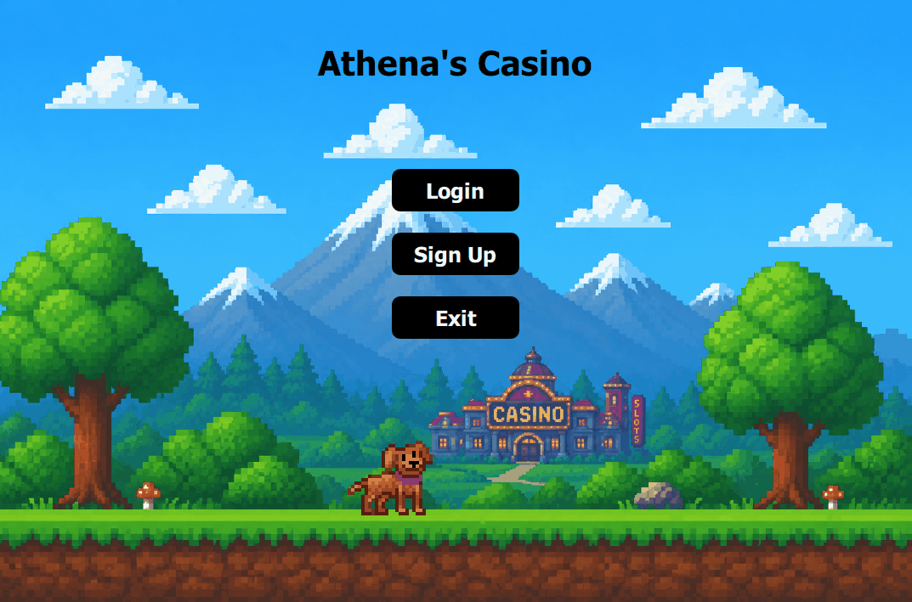

# Full-Stack C++ Casino Application

QtCasino is a desktop casino game built with the Qt Creator IDE that uses the Qt framework to create a fully functional C++ application. The Qt framework consists of modules
such as Qt Core, Qt SQL and Qt Quick which all work together to support QtCasino's architecture. The project also uitlizes a dockerized MySQL database to create a persistent data storage
for user credentials and account balances. The project combines a modern Qt graphical user interface with a dockerized MySQL backend to create a fully deployable full-stack desktop application.

---

## Application Preview

### Main Menu


### Blackjack Gameplay


### Login System


---

## Technical Skills Demonstrated

- Object-Oriented Programming (OOP)
- GUI Development with Qt Quick and QML
- Full-Stack Desktop Application Architecture
- Database Design & Integration
- Docker Containerization
- SQL Database Management
- Event-Driven Programming
- Client-Server Communication
- Windows Application Deployment

---

## Development Pipeline

### User Interface Development
Purpose: Build a modern desktop user interface
<br>
Most Relevant Files: [Main QML](QTCasino_Source/main.qml), [QML QRC](QTCasino_Source/qml.qrc)
- Developed the graphical user interface using Qt Quick and QML
- Created reusable UI components and responsive layouts.
- Implemented event-driven interactions using Qt Signals and Slots.

<p>
    
</p>

### Game Logic Development
Purpose: Implement Casino Game Functionality
<br>
Most Relevant File: [blackjack.cpp](QTCasino_Source/blackjack.cpp), [blackjack.h](QTCasino_Source/blackjack.h)
- Developed object-oriented C++ classes for casino games.
- Implemented game rules, betting logic, and balance management.
- Utilized encapsulation and class inheritance to organize application logic.
```cpp
struct Card
{
    std::string suit;
    std::string rank;
    int value;
};
```

↓

### Database Integration
Purpose: Persist user account information
<br>
Relevant Files: [mysql_connector.cpp](QTCasino_Source/mysql_connector.cpp), [mysql_connector.h](QTCasino_Source/mysql_connector.h)
- Integrated a MySQL database using the Qt SQL module.
- Stored user credentials and account balances.
- Implemented SQL queries for account creation, login, and balance updates.
```cpp
QSqlQuery query;
query.prepare("SELECT * FROM users " "WHERE username = :username " "AND password = :password");
```
↓

### Docker Containerization
Purpose: Create a portable database environment
<br>
Relevant Files: [docker](docker/docker-compose.yml), [init.sql](sql/init.sql)
- Containerized the MySQL database using Docker.
- Automated database creation through initialization scripts.
- Created a reproducible development and deployment environment.

↓

### Desktop Application Deployment
Purpose: Package and automeate deployment for users
- Developed Windows batch script to automate application startup and shutdown
- Automatically launched Docker Desktop and verified Docker availability
- Started the MySQL container before launching the QtCasino application.

---

## Features

- User Authentication system
- Persistent database-backed account storage using MySQL
- Blackjack gameplay system developed in C++ using OOP
- Automated Docker container startup/shutdown

---

## Architecture

Front-end Infrastructure:
- Qt / QML front-end using qrc and main.qml

Back-end Infrastructure:
- Dockerized MySQL database
- SQL database storage
- SQL initialization scripts
- C++ OOP design application logic

---

## How To Run

### Requirements
- Windows 10/11
- Docker Desktop Installed

### Startup
1. Download QtCasino_Deploy.zip in Releases Page
2. Extract folder
3. Run StartCasino.bat

I created this script to automatically
- Start Docker Desktop
- Launch the MySQL container
- Opens the QtCasino Application
- Stops the contnainer when the application closes

---

## Author
Anthony Klimas  
Computer Science Major  
Mathematics Minor  
University of Massachusetts Lowell  


