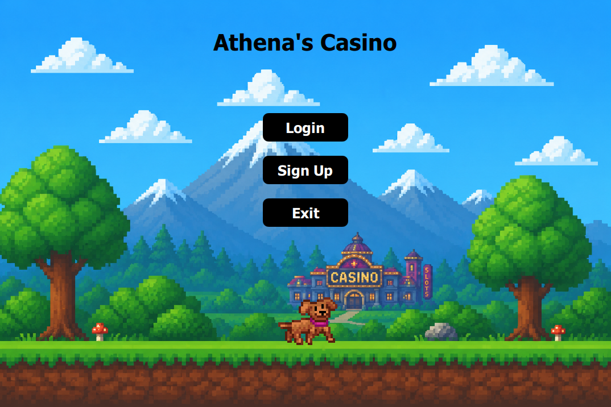
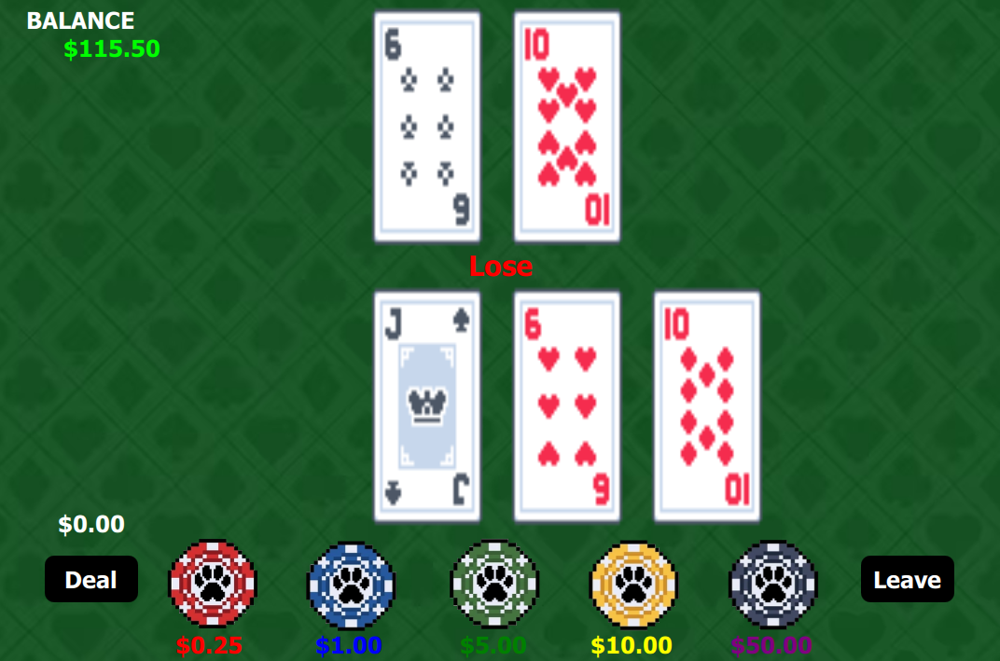
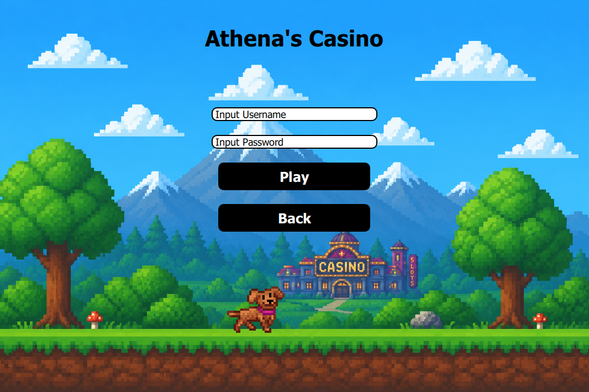

# Full-Stack C++ Casino Application

QtCasino is a desktop casino application built with Qt Creator which uses technologies such as C++, Qt/QML, Docker and MySQL.
The project combines a modern Qt graphical user interface with a Dockerized MySQL backend to create a fully deployable full-stack desktop application.

---

## Application Preview

### Main Menu

### Blackjack Gameplay

### Login System

## Technical Skills Demonstrated
- Object-Oriented Programming (OOP)
- GUI Development
- Full-Stack Application Architecture
- Database Integration
- Docker Containerization
- SQL Database Management
- Event-Driven Programming
- Frontend/Backend Integration
- Windows Application Deployment

---

## Technologies & Concepts Explained
This application uses many complicated technologies and concepts to create a fully functional application that has a professionally made
UI that can be easily traversed by the user.

### C++
- Developed the backend using C++ which uses Object-Oriented Programming concepts like inheritance, abstraction and encapsulation. 
- Created custom classes and objects to create a backend that would mathematically make the game work properly.
- Integrated backend database communication using Qt SQL and MySQL database drivers

### Qt/QML
- Developed a desktop graphical user interface using Qt Quick/QML integrated with C++ backend application logic
- Implemented event-driven programming concepts using Qt signals, slots, and QML UI interactions
- Connected QML frontend components with object-oriented C++ backend systems for game logic and database communication
- Utilized Qt SQL modules to support persistent database-backed user authentication
- Packaged and deployed a standalone Windows Qt application using windeployqt and Qt runtime dependencies
- Designed modular UI/backend architecture separating frontend presentation logic from backend application systems

### MySQL
- Designed and implemented a relational MySQL database system for persistent user authentication and account data storage
- Stored and managed user account information including usernames, passwords, and balances
- Integrated MySQL database connectivity into a Qt/C++ desktop application using the Qt SQL module
- Developed SQL initialization scripts to automatically create and configure database schemas during container startup
- Containerized the MySQL backend using Docker for simplified deployment and environment consistency
- Configured database communication between a Dockerized backend and Qt/QML frontend application
- Managed persistent user data through SQL queries and backend database operations

### Docker
- Containerized the MySQL backend using Docker to create a portable database environment
- Configured Docker Compose services to automate MySQL database deployment and initialization
- Implemented automated startup and shutdown workflows connecting the Qt desktop application with the Dockerized backend
- Utilized SQL initialization scripts during container creation to automatically configure database schemas and tables
- Managed persistent database storage through Docker volume configuration
- Integrated containerized backend services with a Qt/C++ frontend application for local full-stack deployment

---

## Features

- User Authentication system
- Persistent database-backed account storage using MySQL
- Blackjack gameplay system devloped in C++ using OOP
- Automated Docker container startup/shutdown

---

## Architecture

Front-end Infrastructure:
- Qt / QML front-end using qrc and main.qml

Back-end Infrastructure:
- Dockerized MySQL database
- SQL database storage
- SQL initalization scripts
- C++ OOP design application logic

---

## How To Run

### Requirements
- Windows 10/11
- Docker Desktop Installed

### Startup
1. Download QtCasino_Deploy.zip
2. Extract folder
3. Run StartCasino.bat

I created this script to automatically
- Start Docker Desktop
- Launch the MySQL container
- Opens the QtCasino Application
- Stops the cotnainer when the application closes

---

##Author
Anthony Klimas  
Computer Science Major  
Mathematics Minor  
University of Massachusetts Lowell  

